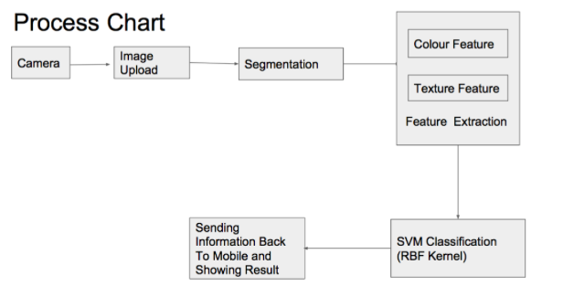

# Food-Recognition

## Sections 
+ [Objective](https://github.com/vipul-khatana/Food-Recognition#objective)
+ [Technique Employed](https://github.com/vipul-khatana/Food-Recognition#techniques-employed)
+ [How to run](https://github.com/vipul-khatana/Food-Recognition#how-to-run)
+ [Author](https://github.com/vipul-khatana/Food-Recognition#author)
+ [Contributing](https://github.com/vipul-khatana/Food-Recognition#contributing)

## Objective
In this project we tackle the problem of recognizing a food item from an image and subsequently measuring the calorie intake from the image of the dishes being consumed. This part deals with only recognising the food item. The work here has been done on identifying rice, bread, puri, idli and dosa, all of which are Indian cuisine. This project finds application in the area of health analytics, where dieticians can recommend their patients the calorie intake, and the patients by using an app can take the photo of the meal they consume and keep track of their calorie in take.Further the data of calorie intake can also be used to find the co relation between the calorie consumption and the various health problems.  

## Techniques Employed 
The following is a simple process chart of how the task is achieved 

In this project we focus on step 3,4 and 5 which have been explained in brief below 

+ **Segementation** - Mean shift algorithm is applied for the process of segmentation. It consisted of five steps : [CIELAB conversion](https://en.wikipedia.org/wiki/Lab_color_space), [Pyramidal mean-shift filtering](https://en.wikipedia.org/wiki/Mean_shift), [Region growing](https://en.wikipedia.org/wiki/Region_growing), [Region merging](https://en.wikipedia.org/wiki/Statistical_region_merging), [Plate Detection/Background deletion](https://en.wikipedia.org/wiki/Background_subtraction) 

+ **Feature Extraction** - Color feature extraction was done using [k-means algorithm](https://en.wikipedia.org/wiki/K-means_clustering). While the [Local Binary Pattern](https://en.wikipedia.org/wiki/Local_binary_patterns) operator was used for texture extraction. 

+ **Classification** - Support Vector Machine(SVM) with an RBF Kernel is used for the process of classification. 

## How to run
Keep all the files in the same directory and open main.m in MATLAB.

Run this file and chose the image you want to classify. Since as of now, it is being employed only for 5 items so please make sure that the image belongs to one of those 5 categories. 

## Author: 
* [Vipul Khatana](https://github.com/vipul-khatana)

Project under [**Dr. Brejesh Lall**](http://ee.iitd.ernet.in/people/brijeshlall.html)

## Contributing

1) Fork it (https://github.com/vipul-khatana/Food-Recognition/fork)
2) Create your feature branch `git checkout -b feature/fooBar`
3) Commit your changes `git commit -am 'Add some fooBar'`
4) Push to the branch `git push origin feature/fooBar`
5) Create a new pull request 
